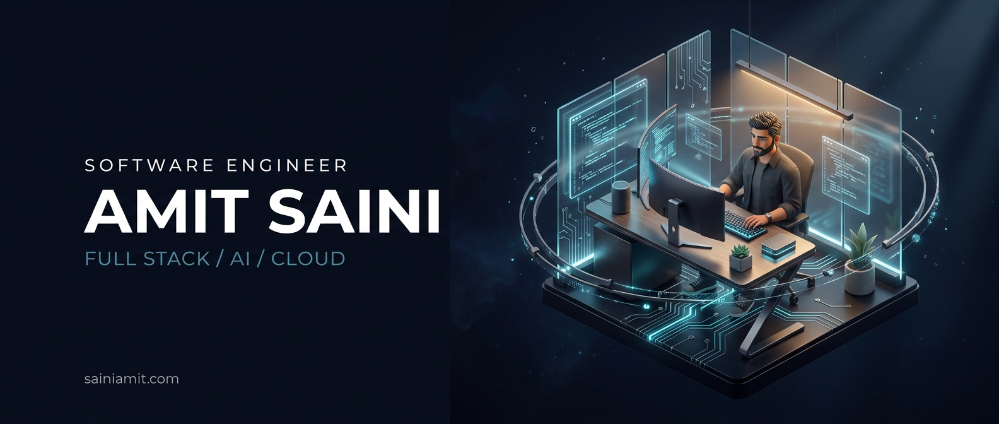
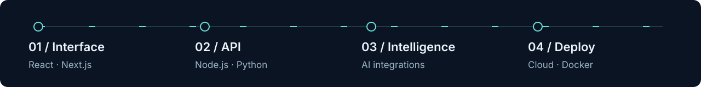
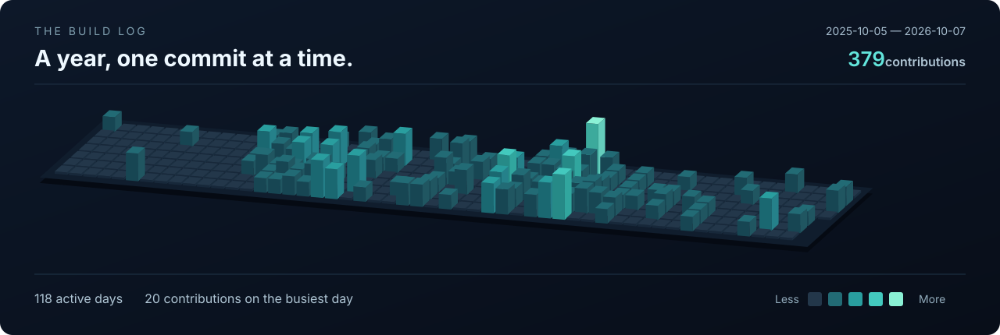

  <a href="https://sainiamit.com"><strong>Portfolio</strong></a> &nbsp; / &nbsp;
  <a href="https://github.com/amitsaini-9?tab=repositories"><strong>Repositories</strong></a> &nbsp; / &nbsp;
  <a href="https://www.linkedin.com/in/as-amit/"><strong>LinkedIn</strong></a> &nbsp; / &nbsp;
  <a href="mailto:hello@sainiamit.com"><strong>Let's talk</strong></a>

# Hi, I'm Amit.

**Full-stack developer & AI engineer based in India.** I take ideas from the first interface to the API, AI integration and production deployment.

Currently a **Software Development Engineer at Intap Studio**, building **Photozoot AI**. My work spans AI-powered products, SaaS applications and automation. B.Tech in Computer Science, Rajasthan Technical University, 2022–2026.

## Selected builds

| Project | What I built | Explore |
| :--- | :--- | :--- |
| **ApplyX** | AI-assisted job discovery, matching and applications. | [Live app](https://apply-x-auto-job-hunter.vercel.app) |
| **AI Interviewer** | Interview practice with AI characters and real-time speech. | [Live app](https://ai-interviewer-indol-three.vercel.app) |
| **Talker** | Anonymous conversations with people and AI characters. | [Live app](https://project-v2-one.vercel.app) |
| **Buildera** | Agency website with cinematic visuals and scroll-driven motion. | [Live site](https://buildera.sainiamit.com) |
| **CodeSync** | A collaborative coding interview platform. | [Source](https://github.com/amitsaini-9/CodeSync) |
| **AI-MailFlow** | An AI-powered email client. | [Source](https://github.com/amitsaini-9/AI-MailFlow) |

## Tools I build with

**Interfaces** &nbsp; TypeScript · JavaScript · React · Next.js · Tailwind CSS · Three.js 
**Systems** &nbsp; Node.js · Express · Python · REST APIs 
**Data** &nbsp; PostgreSQL · MongoDB · Prisma · Supabase 
**Cloud & automation** &nbsp; AWS · Google Cloud · Docker · Vercel · n8n

## Built over time

Watch the contribution trail

 
<picture>
  <source media="(prefers-color-scheme: dark)" srcset="https://raw.githubusercontent.com/amitsaini-9/amitsaini-9/output/github-snake-dark.svg" />
  <source media="(prefers-color-scheme: light)" srcset="https://raw.githubusercontent.com/amitsaini-9/amitsaini-9/output/github-snake.svg" />
  
</picture>

---

**Have something worth building?** 
I'm open to freelance projects and remote opportunities. [hello@sainiamit.com](mailto:hello@sainiamit.com) · [sainiamit.com](https://sainiamit.com)
